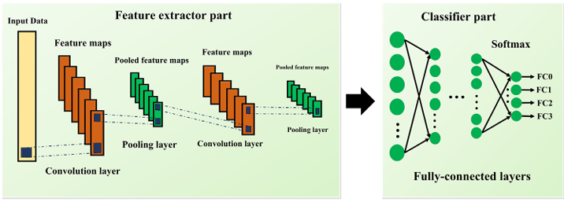
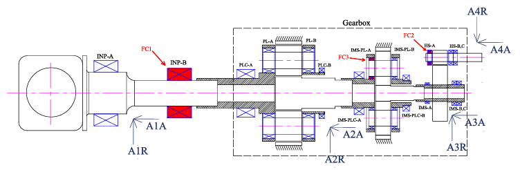
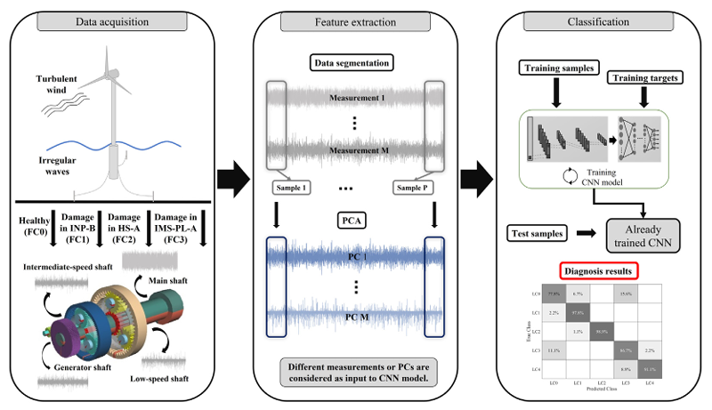

# Wind Turbine Drivetrain Fault Diagnosis

A deep learning fault classification model for wind turbine drivetrain bearings using a combined PCA-CNN approach.

## Overview

Implementation of the fault detection method proposed in:

"Fault detection of offshore wind turbine drivetrains in different environmental conditions through optimal selection of vibration measurements" by Dibaj et al. (2023)
DOI: [10.1016/j.renene.2022.12.049](https://doi.org/10.1016/j.renene.2022.12.049)
(If you find the work useful, you are welcome to cite it!)


This project implements a combined Principal Component Analysis (PCA) and Convolutional Neural Network (CNN) approach (Fig. 1) to detect bearing faults in a 5-MW NREL reference drivetrain high-fidelity model. The model is capable of identifying faults in main bearings, low-speed shaft planet bearings, and high-speed shaft bearings (Fig. 2). Fig. 3 illustrates the overall procedure of the multi-measurement fault classification approach proposed in the paper. According to the paper's findings, measurements from sensors A1A and A3A yield the highest detection accuracy for the studied fault locations. Therefore, the current implementation uses time series data from these two sensors as input.


<p align="center">
  
  <br>
  <em>Fig. 1: CNN model architecture</em>
</p>

<p align="center">
  
  <br>
  <em>Fig. 2: Fault and measurement locations on drivetrain schematic layout</em>
</p>

<p align="center">
  
  <br>
  <em>Fig. 3: Overall procedure of multi-measurement fault detection approach presented in the paper</em>
</p>


## Dataset

The original vibration dataset used in this project, along with additional information, is available at: 
DOI: [10.5281/zenodo.7674842](https://doi.org/10.5281/zenodo.7674842)

The HuggingFace version of this dataset (containing the target sensors data used in this project) is available at:
[https://huggingface.co/datasets/alidi/wind-turbine-5mw-bearing-dataset]

## Features

- Vibration-based fault detection using optimal sensor placement
- Analysis under three environmental conditions
- Time series signal processing
- PCA for dimension reduction and feature extraction
- CNN-based fault classification
- Multi-class fault diagnosis
  

## Getting Started

### Prerequisites
- Python >=3.10
- Poetry for dependency management

### Installation
1. Clone the repository:
```bash
git clone https://github.com/alidi24/deep-learning-fault-diagnosis.git
cd deep-learning-fault-diagnosis
```

2. Install dependencies with Poetry:
```bash
poetry install
```

### Training the Model
Run the training script:
```bash
poetry run python train.py
```

The model trains on the dataset from Hugging Face Hub using default configurations from `config.py`. Training checkpoints and test confusion matrix are saved to the `model_checkpoints` directory and project root respectively. Progress is displayed in the console output.

### Project Structure
**train.py**: Main training script with callbacks for checkpointing and early stopping.  
**src/config.py**: Configuration settings for model architecture, training parameters, and data preprocessing.  
**src/model.py**: CNN model architecture definition with convolutional and fully connected layers.  
**src/data_module.py**: PyTorch Lightning data module handling dataset loading, preprocessing, and data loading.  
**src/dataset_manager.py**: Manages dataset splitting into train/validation/test sets.  
**src/hf_transforms.py**: Contains PCA and frame splitting transformations for data preprocessing.  
**src/lightning_module.py**: PyTorch Lightning module implementing training, validation, and testing loops.  
**pyproject.toml**: Project dependencies and metadata managed by Poetry.


## License

This project is licensed under the MIT License - see the [LICENSE](LICENSE) file for details.


